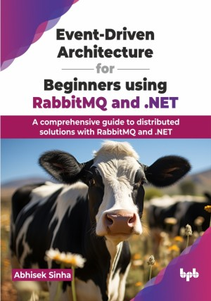

# Event-Driven Architecture for Beginners using RabbitMQ and .NET

The key to event-driven architecture: A beginner's journey with RabbitMQ and .NET

This is the repository for [Event-Driven Architecture for Beginners using RabbitMQ and .NET
](https://bpbonline.com/products/event-driven-architecture-for-beginners-using-rabbitmq-and-net?variant=43385630654664),published by BPB Publications.

## About the Book
By using .NET and RabbitMQ, developers can take advantage of the capabilities of both technologies to create event-driven systems that are optimized for performance and maintainability. This book aims to provide a comprehensive guide for individuals who wish to learn the implementation of event-driven architecture using .NET and RabbitMQ, from understanding the core concepts to implementing practical solutions.

It covers the fundamental concepts of event-driven architecture, including the publish-subscribe pattern and message queues, as well as practical implementation details such as setting up RabbitMQ and using .NET to build event-driven systems. The book also covers advanced topics such as scalability, reliability, and security, and includes real-world case studies to illustrate the challenges and solutions involved in implementing event-driven architecture.

Throughout the book, readers will learn about the concepts, tools, and techniques needed to design, implement and maintain an event-driven system using .NET and RabbitMQ. Additionally, readers will also get an understanding of how to address the challenges that arise while implementing such systems and best practices to overcome them.

## What You Will Learn
• Architect robust event-driven solutions using RabbitMQ and .NET.

• Implement scalable and efficient distributed systems with confidence.

• Apply best practices for seamless integration and software development.

• Navigate complex decision-making processes in distributed solution strategies.

• Enhance expertise in orchestrating solutions for diverse software development roles.
